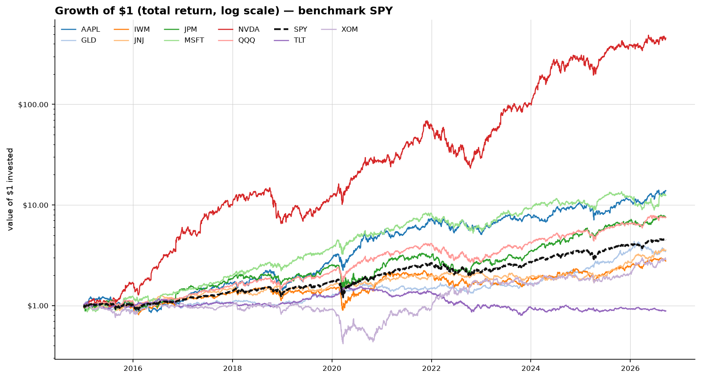
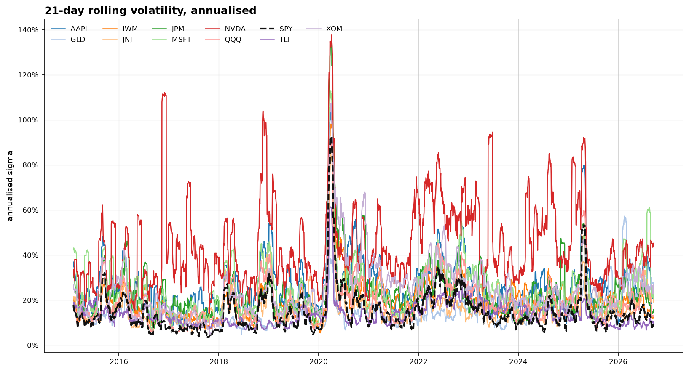
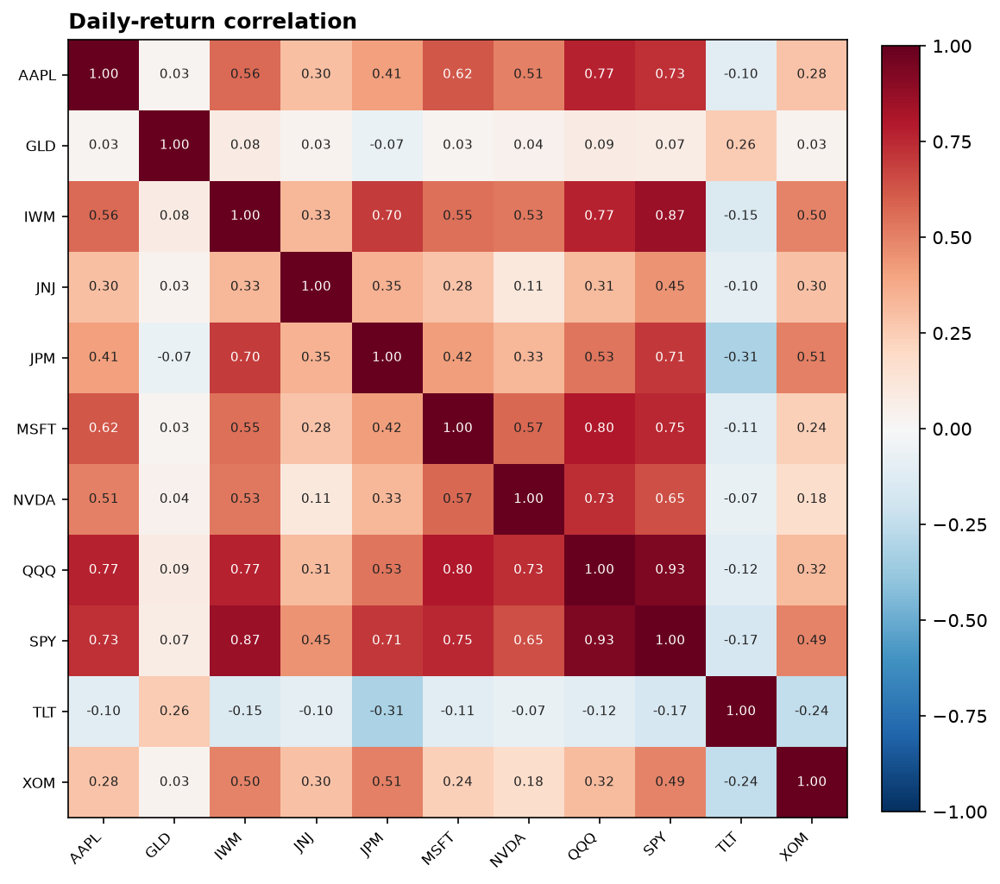
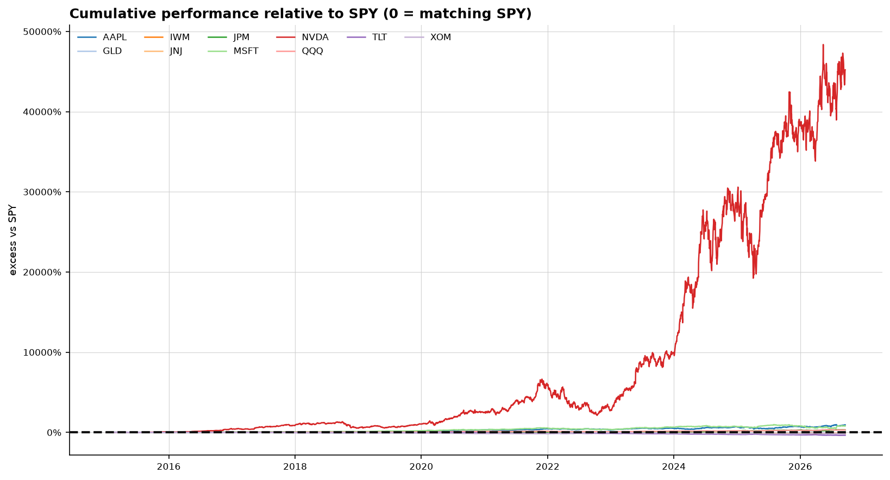
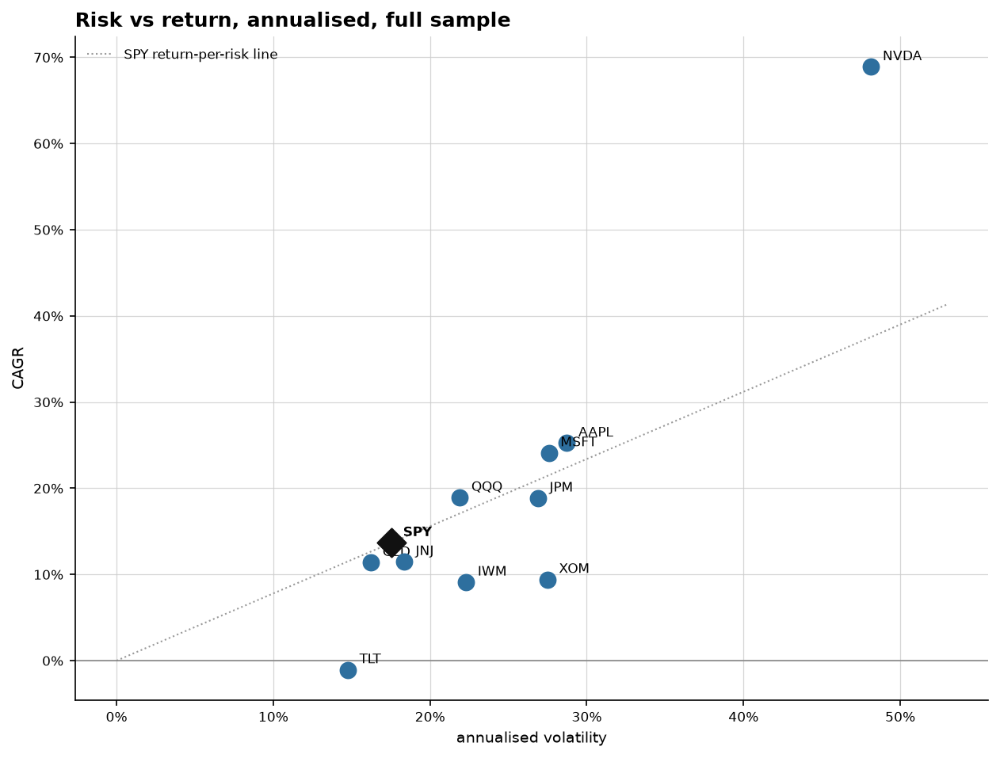

# MarketEngine — run `baseline`

*Generated 2026-09-18 17:26 UTC from `config/default.yml` (sha256 `3c59f1005fc9…`).*

- **Provider:** `yfinance`
- **Universe:** AAPL, MSFT, NVDA, JPM, XOM, JNJ, QQQ, IWM, TLT, GLD
- **Benchmark:** `SPY`
- **Effective window:** 2015-01-02 → 2026-09-18 (2,945 sessions, 32,395 panel rows)
- **Calendar:** aligned to `benchmark`, gaps forward-filled up to 3 session(s) (0 filled bars in total)
- **Risk-free:** 2.00% annual (0.007858% daily) for Sharpe and CAPM alpha

## 1. Absolute performance and risk

Returns are computed from `adj_close` (split- and dividend-adjusted), so these are total returns. `var_95_1d` is the empirical 5th percentile of daily returns, not a Gaussian approximation.

| symbol   |   n_obs | first_date   | total_return   | cagr   | ann_volatility   |   sharpe |   sortino | max_drawdown   | max_dd_trough   | hit_rate   | var_95_1d   |
|:---------|--------:|:-------------|:---------------|:-------|:-----------------|---------:|----------:|:---------------|:----------------|:-----------|:------------|
| SPY      |    2944 | 2015-01-05   | 347.61%        | 13.69% | 17.55%           |     0.71 |      0.99 | -33.72%        | 2020-03-23      | 54.62%     | -1.65%      |
| NVDA     |    2944 | 2015-01-05   | 45,567.64%     | 68.91% | 48.15%           |     1.29 |      1.99 | -66.34%        | 2022-10-14      | 54.28%     | -4.42%      |
| AAPL     |    2944 | 2015-01-05   | 1,287.35%      | 25.25% | 28.73%           |     0.86 |      1.26 | -38.52%        | 2019-01-03      | 53.16%     | -2.71%      |
| MSFT     |    2944 | 2015-01-05   | 1,148.17%      | 24.12% | 27.58%           |     0.85 |      1.27 | -37.15%        | 2022-11-03      | 53.23%     | -2.66%      |
| QQQ      |    2944 | 2015-01-05   | 658.52%        | 18.94% | 21.90%           |     0.81 |      1.15 | -35.12%        | 2022-11-03      | 55.98%     | -2.19%      |
| JPM      |    2944 | 2015-01-05   | 652.85%        | 18.86% | 26.89%           |     0.7  |      1.03 | -43.63%        | 2020-03-23      | 52.38%     | -2.51%      |
| GLD      |    2944 | 2015-01-05   | 252.55%        | 11.39% | 16.24%           |     0.62 |      0.88 | -26.40%        | 2026-07-16      | 53.19%     | -1.57%      |
| JNJ      |    2944 | 2015-01-05   | 256.34%        | 11.49% | 18.34%           |     0.58 |      0.83 | -27.37%        | 2020-03-23      | 52.17%     | -1.64%      |
| IWM      |    2944 | 2015-01-05   | 176.98%        | 9.11%  | 22.31%           |     0.41 |      0.58 | -41.13%        | 2020-03-23      | 52.96%     | -2.07%      |
| XOM      |    2944 | 2015-01-05   | 186.48%        | 9.43%  | 27.49%           |     0.39 |      0.57 | -61.34%        | 2020-03-23      | 51.15%     | -2.59%      |
| TLT      |    2944 | 2015-01-05   | -11.67%        | -1.06% | 14.76%           |    -0.13 |     -0.19 | -48.35%        | 2023-10-19      | 51.09%     | -1.48%      |

## 2. Performance relative to SPY

`beta`, `alpha_annual` and `r_squared` come from an OLS regression of excess returns on SPY's excess returns. `alpha_annual` is annualised arithmetically (daily alpha x 252) because alpha is an average per-period abnormal return, not a compounded path. `up_capture` of 1.20 means that on an average day SPY rose, the symbol rose 20% more than SPY did; `down_capture` above 1 means it fell more than SPY on an average down day. Both are ratios of geometric mean per-day returns rather than of compounded totals, which over a sample this long saturate against +infinity and -100% and stop discriminating.

| symbol   |   beta | alpha_annual   |   corr_to_benchmark |   r_squared | tracking_error   |   information_ratio | active_return_annual   |   up_capture |   down_capture |
|:---------|-------:|:---------------|--------------------:|------------:|:-----------------|--------------------:|:-----------------------|-------------:|---------------:|
| SPY      |   1    | 0.00%          |                1    |        1    | 0.00%            |                     | 0.00%                  |         1    |           1    |
| NVDA     |   1.77 | 40.02%         |                0.65 |        0.42 | 39.18%           |                1.27 | 55.22%                 |         2.03 |           1.7  |
| AAPL     |   1.19 | 9.88%          |                0.73 |        0.53 | 19.98%           |                0.61 | 11.56%                 |         1.21 |           1.13 |
| MSFT     |   1.18 | 8.78%          |                0.75 |        0.57 | 18.47%           |                0.6  | 10.43%                 |         1.23 |           1.15 |
| QQQ      |   1.16 | 3.35%          |                0.93 |        0.87 | 8.43%            |                0.64 | 5.25%                  |         1.23 |           1.2  |
| JPM      |   1.09 | 5.43%          |                0.71 |        0.5  | 19.00%           |                0.34 | 5.17%                  |         1.06 |           1.02 |
| GLD      |   0.07 | 9.31%          |                0.07 |        0.01 | 23.04%           |               -0.1  | -2.30%                 |         0.12 |           0.01 |
| JNJ      |   0.47 | 4.80%          |                0.45 |        0.2  | 18.90%           |               -0.1  | -2.20%                 |         0.41 |           0.34 |
| IWM      |   1.1  | -4.40%         |                0.87 |        0.75 | 11.31%           |               -0.28 | -4.58%                 |         1.12 |           1.19 |
| XOM      |   0.77 | 1.22%          |                0.49 |        0.24 | 24.23%           |               -0.07 | -4.26%                 |         0.68 |           0.68 |
| TLT      |  -0.14 | -0.19%         |               -0.17 |        0.03 | 24.77%           |               -0.58 | -14.74%                |        -0.11 |          -0.12 |

## 3. Correlation of daily returns

Pairwise-complete Pearson correlation, blank where two symbols share fewer than 250 sessions.

|      |   AAPL |    GLD |    IWM |    JNJ |    JPM |   MSFT |   NVDA |    QQQ |    SPY |    TLT |    XOM |
|:-----|-------:|-------:|-------:|-------:|-------:|-------:|-------:|-------:|-------:|-------:|-------:|
| AAPL |  1     |  0.028 |  0.565 |  0.302 |  0.412 |  0.618 |  0.506 |  0.769 |  0.728 | -0.104 |  0.283 |
| GLD  |  0.028 |  1     |  0.08  |  0.035 | -0.069 |  0.031 |  0.044 |  0.086 |  0.072 |  0.256 |  0.033 |
| IWM  |  0.565 |  0.08  |  1     |  0.331 |  0.696 |  0.549 |  0.525 |  0.768 |  0.866 | -0.145 |  0.497 |
| JNJ  |  0.302 |  0.035 |  0.331 |  1     |  0.35  |  0.282 |  0.109 |  0.314 |  0.446 | -0.099 |  0.297 |
| JPM  |  0.412 | -0.069 |  0.696 |  0.35  |  1     |  0.415 |  0.334 |  0.533 |  0.71  | -0.315 |  0.506 |
| MSFT |  0.618 |  0.031 |  0.549 |  0.282 |  0.415 |  1     |  0.574 |  0.803 |  0.752 | -0.112 |  0.239 |
| NVDA |  0.506 |  0.044 |  0.525 |  0.109 |  0.334 |  0.574 |  1     |  0.734 |  0.645 | -0.071 |  0.177 |
| QQQ  |  0.769 |  0.086 |  0.768 |  0.314 |  0.533 |  0.803 |  0.734 |  1     |  0.932 | -0.116 |  0.318 |
| SPY  |  0.728 |  0.072 |  0.866 |  0.446 |  0.71  |  0.752 |  0.645 |  0.932 |  1     | -0.169 |  0.494 |
| TLT  | -0.104 |  0.256 | -0.145 | -0.099 | -0.315 | -0.112 | -0.071 | -0.116 | -0.169 |  1     | -0.243 |
| XOM  |  0.283 |  0.033 |  0.497 |  0.297 |  0.506 |  0.239 |  0.177 |  0.318 |  0.494 | -0.243 |  1     |

## 4. Data quality

Every requested symbol was retrieved.

Symbols with something worth knowing about (all of it recorded, none of it silently corrected):

| symbol   |   rows |   coverage_pct |   gaps_forward_filled |   rows_dropped_long_gap | short_history   | adj_close_equals_close   |
|:---------|-------:|---------------:|----------------------:|------------------------:|:----------------|:-------------------------|
| GLD      |   2945 |            100 |                     0 |                       0 | False           | True                     |

Full per-symbol detail: `data/outputs/baseline/data_quality.csv`.

## 5. Figures

**Growth of $1, total return, log scale**

**21-day rolling volatility, annualised**

**Daily-return correlation matrix**

**Cumulative performance relative to SPY**

**Risk vs return, annualised**

## 6. Assumptions that change the numbers

1. **Total return, not price return.** All returns use `adj_close`. Using `close` would read each dividend as a price fall and understate every dividend payer in the universe.
2. **The benchmark defines the trading calendar** (`calendar.align: benchmark`). A date SPY did not trade has no benchmark return, so no relative statistic exists for it.
3. **Gaps are carried forward for at most 3 session(s)** and every carried bar is flagged in the `filled` column. Longer gaps are dropped rather than filled, so each series starts at its own first real session instead of at a fabricated flat stretch.
4. **Volume is never forward-filled.** A carried bar has unknown volume, and NaN is what unknown means; a carried volume would invent trading activity.
5. **Nothing is dropped for being surprising.** Extreme moves, zero-volume sessions and stale price runs are counted in the quality table and kept in the data.
6. **The risk-free rate is a flat 2.00% assumption**, de-annualised geometrically. Swap in a real T-bill series before quoting a Sharpe ratio anywhere it matters.
7. **Pairwise windows.** A symbol with less history than SPY is compared against it only over the sessions they share; `overlap_with_benchmark` in `metrics_summary.csv` reports how many that was.
